## Part 1: Pulse Rate Algorithm

### Contents
Fill out this notebook as part of your final project submission.

**You will have to complete both the Code and Project Write-up sections.**
- The [Code](#Code) is where you will write a **pulse rate algorithm** and already includes the starter code.
   - Imports - These are the imports needed for Part 1 of the final project. 
     - [glob](https://docs.python.org/3/library/glob.html)
     - [numpy](https://numpy.org/)
     - [scipy](https://www.scipy.org/)
- The [Project Write-up](#Project-Write-up) to describe why you wrote the algorithm for the specific case.


### Dataset
You will be using the **Troika**[1] dataset to build your algorithm. Find the dataset under `datasets/troika/training_data`. The `README` in that folder will tell you how to interpret the data. The starter code contains a function to help load these files.

1. Zhilin Zhang, Zhouyue Pi, Benyuan Liu, ‘‘TROIKA: A General Framework for Heart Rate Monitoring Using Wrist-Type Photoplethysmographic Signals During Intensive Physical Exercise,’’IEEE Trans. on Biomedical Engineering, vol. 62, no. 2, pp. 522-531, February 2015. Link

-----

### Code


```python
import matplotlib.pyplot as plt
import glob
import numpy as np
import scipy as sp
import scipy.io
import scipy.signal
import os

def LoadTroikaDataset():
    """
    Retrieve the .mat filenames for the troika dataset.

    Review the README in ./datasets/troika/ to understand the organization of the .mat files.

    Returns:
        data_fls: Names of the .mat files that contain signal data
        ref_fls: Names of the .mat files that contain reference data
        <data_fls> and <ref_fls> are ordered correspondingly, so that ref_fls[5] is the 
            reference data for data_fls[5], etc...
    """
    data_dir = "./datasets/troika/training_data"
    data_fls = sorted(glob.glob(data_dir + "/DATA_*.mat"))
    ref_fls = sorted(glob.glob(data_dir + "/REF_*.mat"))
    return data_fls, ref_fls

def LoadTroikaDataFile(data_fl):
    """
    Loads and extracts signals from a troika data file.

    Usage:
        data_fls, ref_fls = LoadTroikaDataset()
        ppg, accx, accy, accz = LoadTroikaDataFile(data_fls[0])

    Args:
        data_fl: (str) filepath to a troika .mat file.

    Returns:
        numpy arrays for ppg, accx, accy, accz signals.
    """
    data = sp.io.loadmat(data_fl)['sig']
    return data[2:]

def AggregateErrorMetric(pr_errors, confidence_est):
    """
    Computes an aggregate error metric based on confidence estimates.

    Computes the MAE at 90% availability. 

    Args:
        pr_errors: a numpy array of errors between pulse rate estimates and corresponding 
            reference heart rates.
        confidence_est: a numpy array of confidence estimates for each pulse rate
            error.

    Returns:
        the MAE at 90% availability
    """
    # Higher confidence means a better estimate. The best 90% of the estimates
    #    are above the 10th percentile confidence.
    percentile90_confidence = np.percentile(confidence_est, 10)

    # Find the errors of the best pulse rate estimates
    best_estimates = pr_errors[confidence_est >= percentile90_confidence]

    # Return the mean absolute error
    return np.mean(np.abs(best_estimates))

def Evaluate():
    """
    Top-level function evaluation function.

    Runs the pulse rate algorithm on the Troika dataset and returns an aggregate error metric.

    Returns:
        Pulse rate error on the Troika dataset. See AggregateErrorMetric.
    """
    # Retrieve dataset files
    data_fls, ref_fls = LoadTroikaDataset()
    errs, confs = [], []
    for data_fl, ref_fl in zip(data_fls, ref_fls):
        # Run the pulse rate algorithm on each trial in the dataset
        errors, confidence = RunPulseRateAlgorithm(data_fl, ref_fl)
        errs.append(errors)
        confs.append(confidence)
        # Compute aggregate error metric
    errs = np.hstack(errs)
    confs = np.hstack(confs)
    return AggregateErrorMetric(errs, confs)

def segment_signal(signal, fs = 125, window_length_s = 8, window_shift_s = 2):
    window_length = window_length_s * fs
    window_shift = window_shift_s * fs
    idx = list(range(0, len(signal) - window_length, window_shift))
    return([BandpassFilter(signal[i: i + window_length]) for i in idx])
    
def RunPulseRateAlgorithm(data_fl, ref_fl):
    # Load data using LoadTroikaDataFile
    ppg, accx, accy, accz = LoadTroikaDataFile(data_fl)
    
    # Compute pulse rate estimates and estimation confidence.
    signals = dict(zip(['ppg', 'accx', 'accy', 'accz'], LoadTroikaDataFile(data_fl)))
    for sigtype in ['ppg', 'accx', 'accy', 'accz']:
        signals[sigtype] = segment_signal(signals[sigtype])
    signals = [{sigtype:signals[sigtype][i] for sigtype in ['ppg', 'accx', 'accy', 'accz']}  for i in range(len(signals['ppg']))]
    fft_signals = [{k: fft_func(v, fs = 125) for k,v in  signal.items()} for signal in signals]
    for fftsig in fft_signals:
        fftsig['acc_maxsum'] = {}
        fftsig['acc_maxsum']['freqs'] = fftsig['accx']['freqs']
        for sigtype in ['accx', 'accy', 'accz']:
            fftsig[sigtype]['fft_mag'] = 1.0*fftsig[sigtype]['fft_mag']/fftsig[sigtype]['fft_mag'].max() 
        fftsig['acc_maxsum']['fft_mag'] = fftsig['accx']['fft_mag'] + fftsig['accy']['fft_mag'] + fftsig['accz']['fft_mag']
        for sigtype in ['accx', 'accy', 'accz']:
            del fftsig[sigtype]
        for sigtype in ['ppg', 'acc_maxsum']:   
            fftsig[sigtype]['fft_mag'] = np.convolve(fftsig[sigtype]['fft_mag'], [0.0357141 ,  0.24107134,  0.44642914,  
                                                                       0.24107134,  0.0357141 ], 'same')      
            fftsig[sigtype]['fft_mag'] = fftsig[sigtype]['fft_mag']/fftsig[sigtype]['fft_mag'].max()
    
    
    ref_HR = sp.io.loadmat(ref_fl)['BPM0'].flatten() 
    errors = []
    confidence = []
    for i, signal in enumerate(fft_signals):
        sig =  signal['ppg']['fft_mag'] - signal['acc_maxsum']['fft_mag']
        maxind = np.argmax(sig)
        errors.append(abs(signal['ppg']['freqs'][maxind]*60 - ref_HR[i]))
        confidence.append(signal['ppg']['fft_mag'][maxind]/sum( signal['ppg']['fft_mag']))
  
    # Return per-estimate mean absolute error and confidence as a 2-tuple of numpy arrays.
    return errors, confidence


def BandpassFilter(signal, fs=125):
    """
    Bandpass filter the signal between 40 and 240 BPM.
    """
    b, a = sp.signal.butter(3, (40/60.0, 240/60.0), btype='bandpass', fs=fs)
    return sp.signal.filtfilt(b, a, signal)

def fft_func(sig, fs):
    siglen = max(len(sig), 4096)
    freqs = np.fft.rfftfreq(siglen, 1/fs)
    fft_mag = np.abs(np.fft.rfft(sig, siglen))
    return  {'freqs': freqs, 'fft_mag': fft_mag}
```


```python
Evaluate()
```


    7.1738843061376363


# Use plt.specgram to visualize your signals in the frequency domain


```python
import matplotlib.pyplot as plt
import os


# freq indo
fs = 125
window_length_s = 8
window_shift_s = 2
window_length = window_length_s * fs
window_shift = window_shift_s * fs

# plot all specgram
data_fls, ref_fls = LoadTroikaDataset()
numcol = 4
for datafl, reffl in zip(data_fls, ref_fls):
    fig, axes = plt.subplots(1, numcol, figsize = (16, 3))
    signals = zip(['ppg', 'accx', 'accy', 'accz'], 
                 [BandpassFilter(i) for i in LoadTroikaDataFile(datafl)])
    #signals['accm'] = np.sqrt(np.sum(np.square(np.vstack((signals['accx'], signals['accy'], signals['accz']))), axis=0) 
    ref_freq = sp.io.loadmat(reffl)['BPM0'].flatten()/60.0
    ref_time = np.arange(len(ref_freq))*window_shift_s
    for j, (sigtype, sigdata) in enumerate(signals):
        axes[j].set_title(sigtype)
        axes[j].specgram(sigdata, Fs = fs, NFFT = window_length, noverlap = window_length - window_shift)
        axes[j].plot(ref_time, ref_freq,  'b', alpha = 0.1) # plot reference HRs on graph      
        axes[j].set_ylim((0.5, 4))
        axes[j].set_xlabel('Time (sec)')
        axes[j].set_ylabel('Frequency (Hz)')
    fig.tight_layout(pad = 1)
    plt.suptitle(os.path.split(datafl)[1], fontsize = 12, y = 1.05)
    plt.show()
```


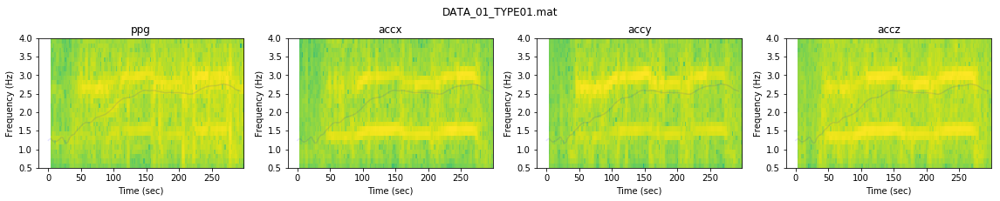


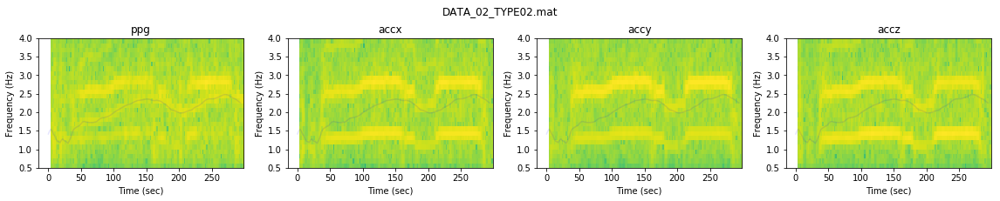


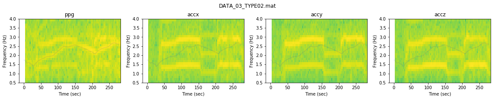


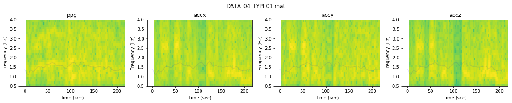


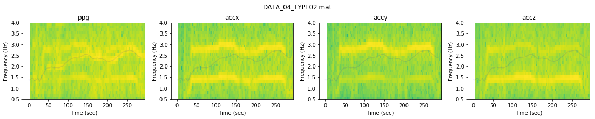


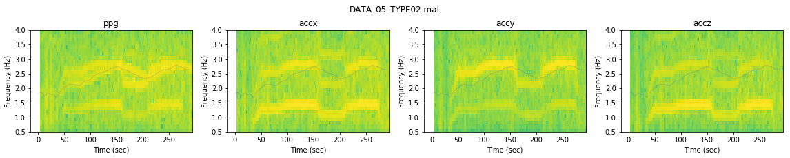


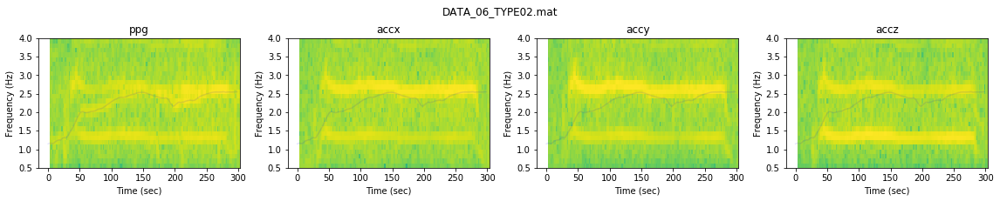


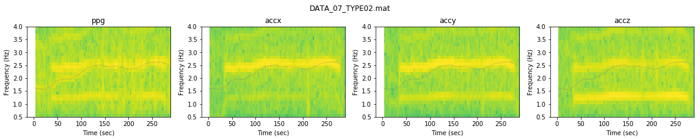


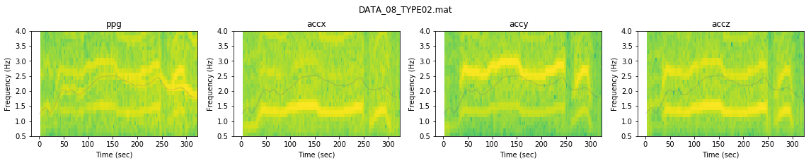


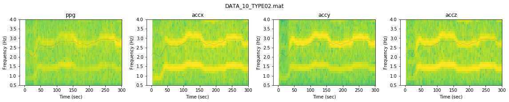


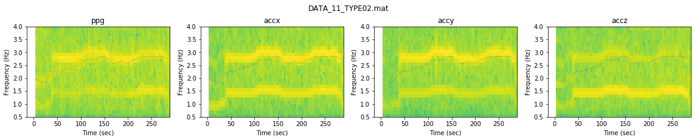


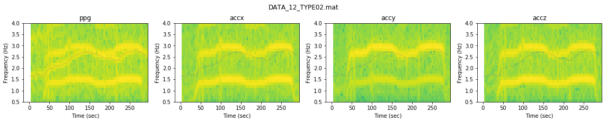


-----
### Next Steps
You will now go to **Test Your Algorithm** to apply a unit test to confirm that your algorithm met the success criteria. 
